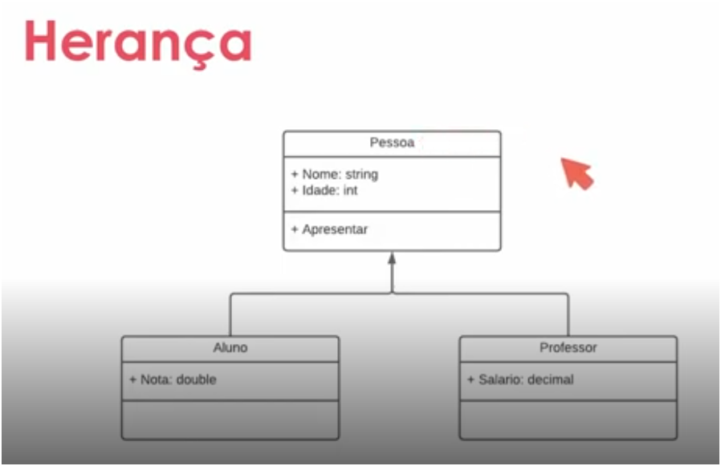
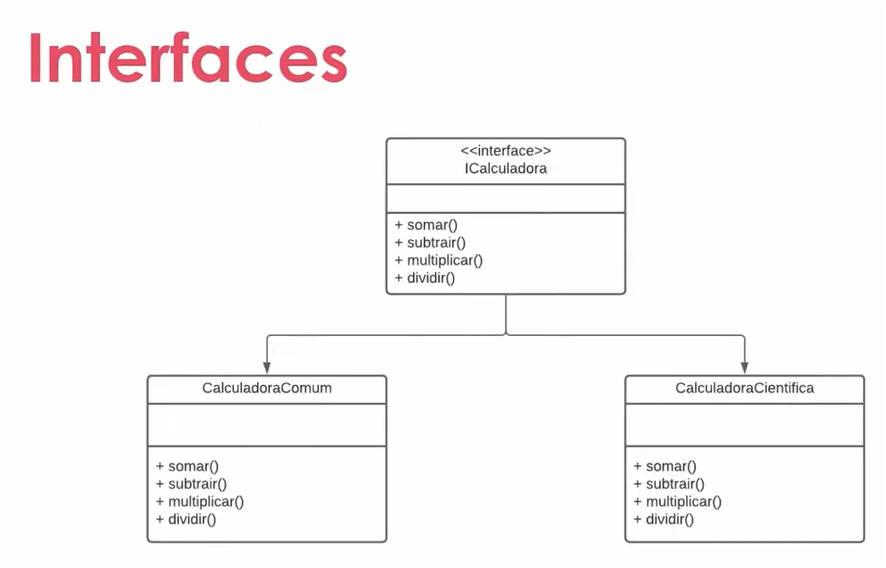

## Just a Review..📝
The propose of this project only is training OOP in .NET

### Object Oriented Programming
Is a programming paradigm, is a technique for a specific purpose, set of rules, methodology, a way of doing things, in this case, abstraction, encapsulation, inheritance and polymorphism..

### Encapsulation
Protect your class and define limits to changing its properties, for exemple, you can define that a class or attibute is blocked for external changes and only you, the class itself, can change that property or attribute..

### Inheritance
Allows us to reuse attributes, methods and behaviors of one class in other classes

Exemplo implemented

### Polymorphism
Polymorphism comes from the Greek language and means "many forms". We can rewrite methods of the child class become different and has its own implementation. Using in _execution time_, we use the reservation word _override_

### Abstract Class
Is intended to be exclusively a model to be inherited, so it cannot be instantiated. You can't work directly with this class, it has to be inherited

Exemplo implemented

### Sealed Classes
It's aims to prevent other classes from inheriting from it, in other words, you tell it that no class can be inherited from this class

### Interfaces
Interfaces is a contract that can be implemented by a class, like as abstract class that you can define attrributes and methods to be implemented by another class, it can be instanced

Exemplo implemented
